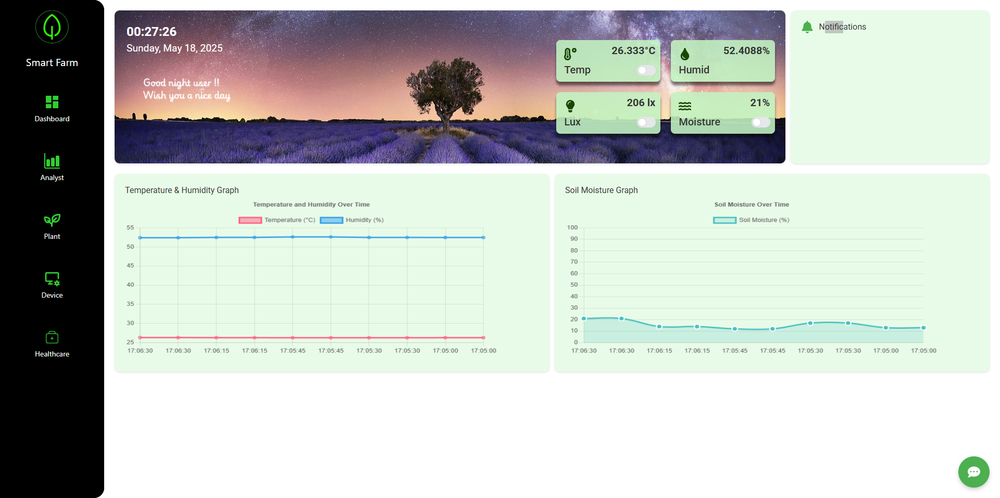
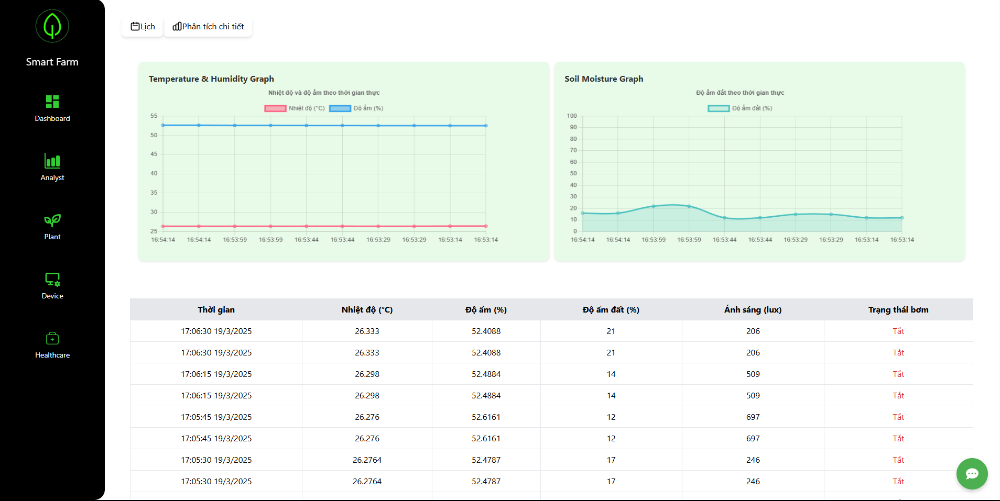
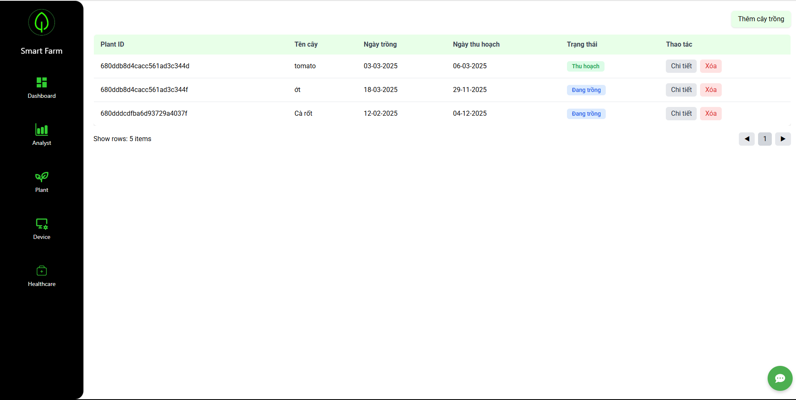
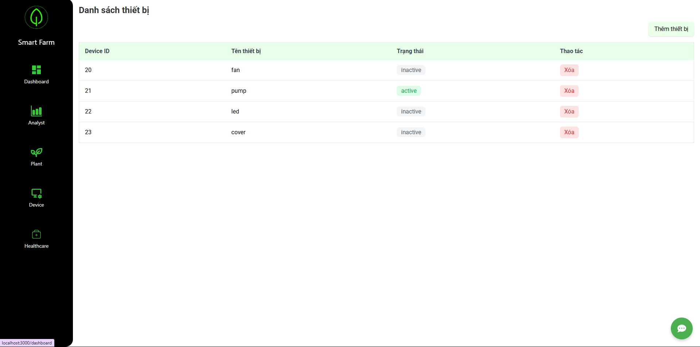
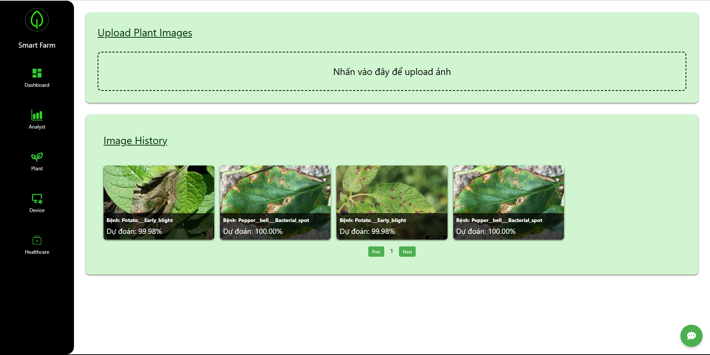

# 🌱 SmartFarm - Hệ thống giám sát và quản lý nông nghiệp thông minh

## 🚀 Giới thiệu
SmartFarm là một hệ thống toàn diện được thiết kế để giám sát và quản lý môi trường nông nghiệp thông minh. Dự án kết hợp công nghệ IoT (Internet of Things), trí tuệ nhân tạo và phân tích dữ liệu để tối ưu hóa điều kiện trồng trọt, phát hiện sớm bệnh cây và tự động hóa các quy trình canh tác.

Trong bối cảnh nông nghiệp hiện đại đang đối mặt với nhiều thách thức như biến đổi khí hậu, khan hiếm nguồn nước và áp lực gia tăng năng suất, SmartFarm cung cấp giải pháp công nghệ giúp nông dân và các doanh nghiệp nông nghiệp có thể:

1. Giám sát liên tục điều kiện môi trường
2. Phát hiện sớm các vấn đề tiềm ẩn
3. Tiết kiệm tài nguyên (nước, phân bón, thuốc trừ sâu)
4.Tăng năng suất và chất lượng cây trồng
5. Ra quyết định dựa trên dữ liệu thực tế

## ✨ Tính năng chính**
-- **Giám sát môi trường thời gian thực**

🌡️ Theo dõi nhiệt độ không khí và đất
💧 Giám sát độ ẩm không khí và đất
☀️ Đo cường độ ánh sáng
🌬️ Phân tích thông số gió và lượng mưa

-- **Phân tích dữ liệu nâng cao**

📊 Phân tích thống kê và biểu đồ trực quan
🔄 Tìm hiểu mối tương quan giữa các thông số
🕒 Nhận diện mẫu dữ liệu theo thời gian

-- **Phát hiện bất thường**

⚠️ Cảnh báo sớm khi phát hiện điều kiện bất thường
📱 Thông báo qua ứng dụng và email
🔍 Phân tích nguyên nhân tiềm ẩn

-- **Phát hiện bệnh cây**

🔬 Sử dụng mô hình CNN (Convolutional Neural Network)
📸 Nhận diện bệnh từ hình ảnh lá cây
🦠 Cơ sở dữ liệu về các bệnh thường gặp

-- **Chatbot hỗ trợ**

💬 Trợ lý ảo giúp trả lời câu hỏi
📚 Cung cấp thông tin và hướng dẫn chăm sóc cây trồng
🤖 Hỗ trợ 24/7 qua giao diện web

-- **Tối ưu hóa điều kiện**

🎯 Đề xuất điều kiện trồng trọt tối ưu
📈 Dự đoán năng suất dựa trên dữ liệu lịch sử
🌱 Lịch trình chăm sóc cây trồng tự động

## **Screenshots**

<table>
  <tr>
    <td></td>
    <td></td>
  </tr>
  <tr>
    <td></td>
    <td></td>
  </tr>
  <tr>
    <td></td>
  </tr>
</table>

